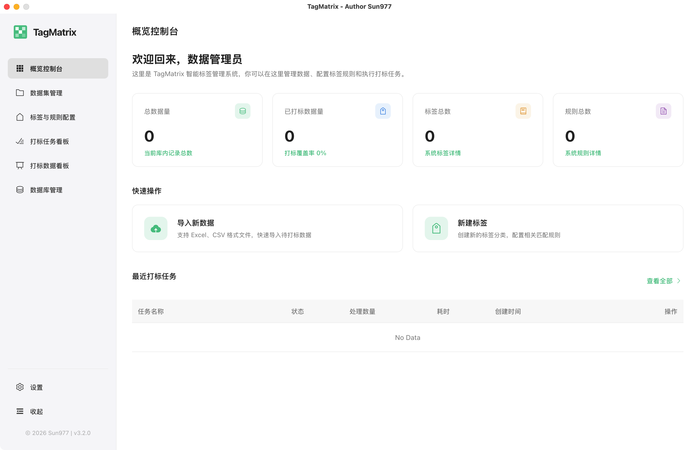
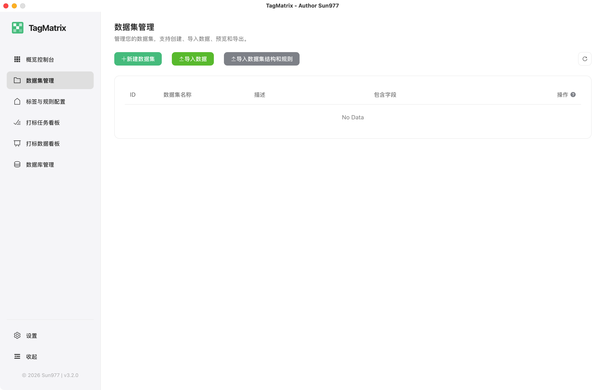
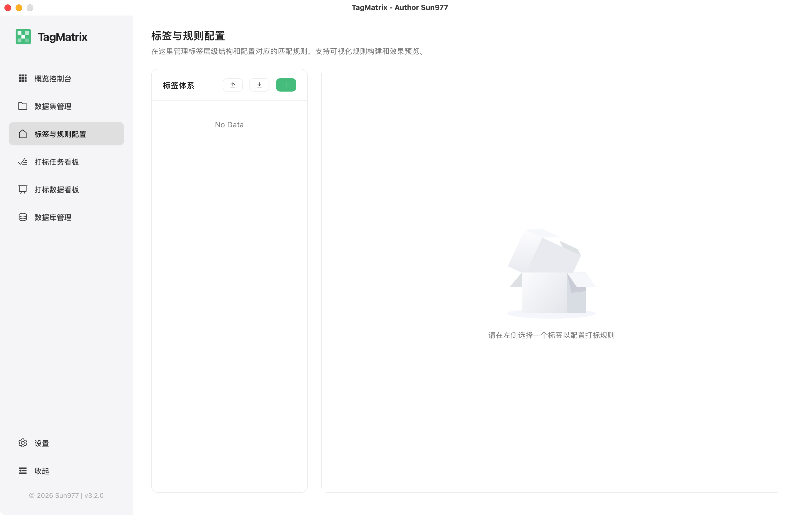
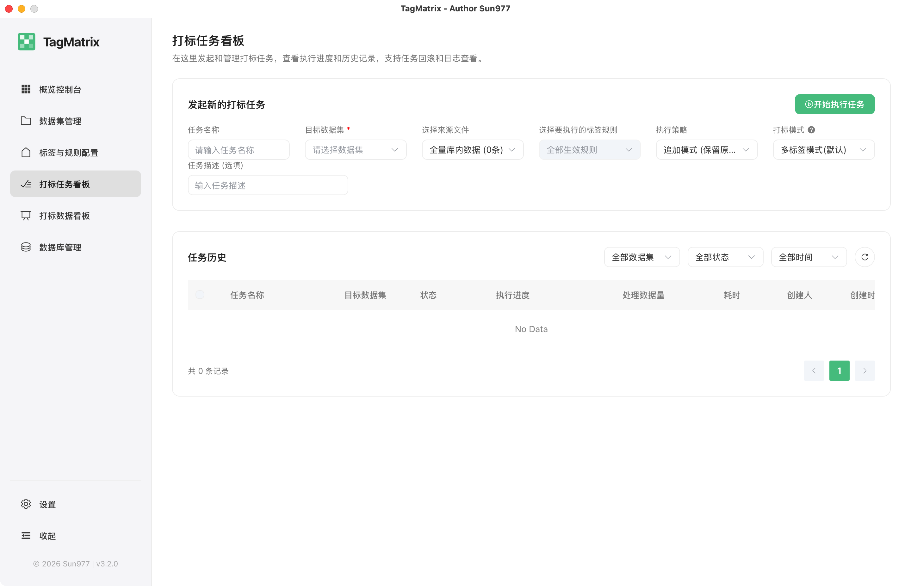
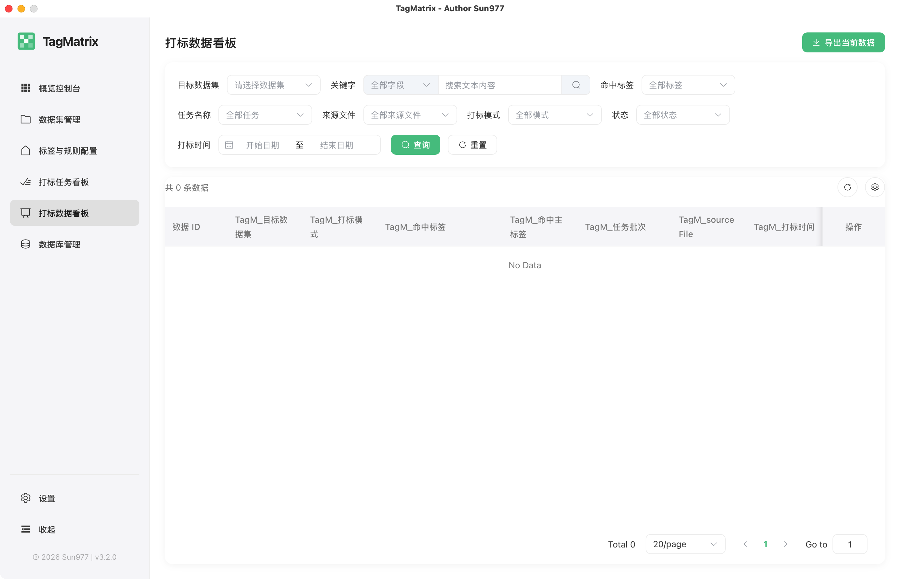
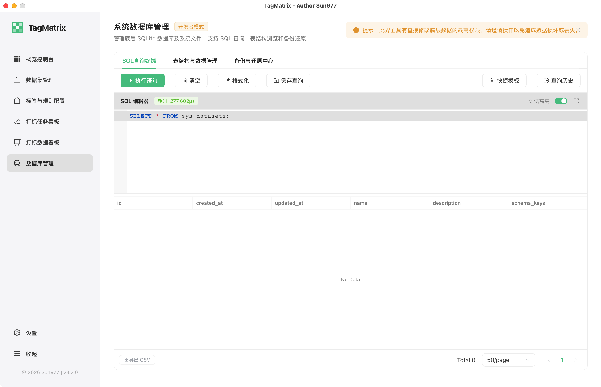
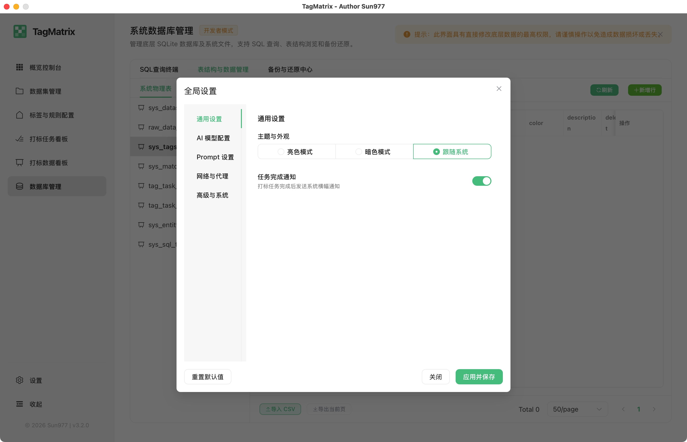

<div align="center">
  
  <h1>TagMatrix</h1>
  <p><b>一个高性能、可视化、可拓展的跨平台数据打标桌面应用程序。</b></p>
  <p>
    
    
    
    
    
  </p>
</div>

<br/>

TagMatrix 是一个致力于解决海量结构化/半结构化数据打标签问题的通用系统。无论是单标签分类、多标签标记，还是主副标签的混合模式，TagMatrix 都能通过其内置的高性能无状态匹配引擎 (`matcher`) 和大语言模型 (AI) 提供极速且精准的自动化打标体验。

本系统采用 **Wails (Go + Vue3)** 构建，最终交付为开箱即用的跨平台本地单体桌面应用程序（支持 Windows `.exe`、macOS `.app` 以及 Linux 可执行文件）。相比传统的 Web B/S 架构，TagMatrix 具有以下显著优势：

- 🌍 **跨平台与开箱即用**：无需额外部署服务器或配置复杂的数据库环境，直接双击运行，完美兼容三大主流操作系统。
- 🌳 **无限极树状标签体系**：彻底打破传统扁平化标签的局限，支持创建多层级、树状结构的标签体系，精准映射复杂业务分类逻辑。
- ⚙️ **强悍的多级规则匹配引擎**：内置高性能无状态匹配引擎，支持任意层级的逻辑组嵌套（AND/OR），提供高达 **19 种专业级匹配算子**（包含正则、包含、数值范围、特殊集集合等），轻松应对最严苛的打标条件。
- 🔒 **绝对的数据隐私保护**：所有业务数据（如数百万行的敏感数据）全部通过 SQLite 集中存储在本地，物理隔离，彻底杜绝数据泄露风险（仅在用户主动授权时发起受控的 AI 模型接口请求）。
- 🚀 **原生级性能与流畅体验**：得益于 Go 语言强大的并发处理能力，系统能极速支撑海量数据的流式读取与查询；结合 Vue3 与 Element Plus，提供媲美现代 Web 应用的丝滑 UI 交互。

---

## 🖥️ 用户界面展示

以下是 TagMatrix V3.0 的主要功能界面截图，展现了其强大的可视化配置与数据管理能力：

### 概览控制台 (Dashboard)
展示全局打标进度、系统标签覆盖率与任务状态监控。


### 数据集管理 (Dataset Management)
异构数据源的物理隔离管理，支持多表头的可视化清洗与导入导出。


### 标签与规则配置 (Tag & Rule Engine)
无限极树状标签体系，支持可视化拖拽配置嵌套的逻辑规则组，并提供基于真实数据的“试运行 (Dry Run)”防崩机制。


### 打标任务看板 (Task Kanban)
控制并记录每一次的批量打标操作，支持细粒度的任务下发、状态实时追踪与“一键安全回退 (Rollback)”。


### 打标数据看板 (Tagged Data View)
融合系统列与用户动态列的全景数据面板，支持复杂组合过滤与 CSV 导出。


### 系统数据库管理 (Database Admin)
*(高级开发者模式功能)* 提供对底层 SQLite 的全量控制能力，包含 SQL 控制台、物理表编辑以及全量 `.db` 快照的备份与还原中心。
<p align="center">
  
  
</p>

## 🎯 核心特性 (Core Features)

*   **⚡️ 本地轻量级数据中心**
    *   引入 **数据集隔离模式**，彻底解决异构文件（如活动表与订单表）的表头污染与冗余问题。
    *   专为大批量数据设计，支持数百万级别数据流式读取与高效查询。
*   **🏷️ 灵活的标签与打标模式**
    *   支持单标签模式、多标签模式、以及主副标签混合模式。
    *   **数据集强绑定**：标签全局通用，打标规则必须绑定具体数据集，彻底避免规则张冠李戴的逻辑惨剧。
*   **🛡️ 安全与可控的执行引擎**
    *   **一键回退 (Rollback)**：每次打标任务生成版本快照与操作日志，打标结果不满意随时安全撤销。
    *   **高阶防崩设计**：底层的物理表操作与高级导入强制剥离自增主键和生命周期字段，杜绝脏数据。
*   **🤖 全局 AI 智能助手 (Planning)**
    *   作为系统的“全局副驾驶”常驻侧边栏，支持自然语言检索数据、智能长尾兜底打标以及生成数据洞察 SQL。
*   **📦 强迁移与工程化解耦**
    *   支持导出全局标签体系资产 (`tags.json`)，以及将指定数据集连同专属规则打包导出 (`dataset_with_rules.json`)，实现业务资产与工程环境的物理分离与无损复用。

## 🛠️ 技术栈 (Tech Stack)

*   **应用框架**: `Wails` (Go + Vue3) - 跨平台本地应用级打包。
*   **后端语言**: `Go` - 利用 Goroutine + Channel 提供强大的异步任务处理能力。
*   **前端生态**: `Vue 3` + `Element Plus` - 提供现代化的数据管理后台体验。
*   **数据库**: `SQLite` + `GORM` - 单文件数据库，完美契合本地离线应用，预留 MySQL/PostgreSQL 扩展能力。
*   **核心引擎**: 基于原 `NeoScan` 项目复用的高性能 `matcher` 引擎。
*   **AI 接入**: `sashabaranov/go-openai`。

## 📚 详细文档 (Documentation)

项目的需求演进、架构设计及相关决策记录存放在 `docs/` 目录下：
*   [EVOLUTION_TagMatrix.md](./docs/TagMatrix/EVOLUTION_TagMatrix.md) - 需求演进与架构决策追踪记录（涵盖 V1.0 至 V2.0 完整演进史）。
*   [DESIGN_TagMatrix.md](./docs/TagMatrix/DESIGN_TagMatrix.md) - 系统核心架构设计方案。
*   [CODING_STANDARDS.md](./docs/TagMatrix/CODING_STANDARDS.md) - 项目开发与代码规范。

## 🚀 快速开始 (Getting Started)

### 环境依赖
*   [Go](https://golang.org/doc/install) 1.20+
*   [Node.js](https://nodejs.org/en/download/) 16+
*   [Wails](https://wails.io/docs/gettingstarted/installation) CLI v2

### 本地开发与运行
1. 克隆仓库至本地：
   ```bash
   git clone https://github.com/your-repo/TagMatrix.git
   cd TagMatrix
   ```
2. 安装前端依赖：
   ```bash
   cd frontend
   npm install
   cd ..
   ```
3. 启动 Wails 开发者模式（支持前端热重载）：
   ```bash
   wails dev
   ```
### 数据保存位置
- 🍏 macOS : ~/Library/Application Support/TagMatrix/
- 🪟 Windows : C:\Users\<用户名>\AppData\Roaming\TagMatrix\
- 🐧 Linux : ~/.config/TagMatrix/


### 编译打包
在项目根目录运行以下命令，即可生成对应平台的单体桌面可执行文件（存放于 `build/bin/` 目录下）：
```bash
wails build
```

## 🔮 未来演进规划 (Future Roadmap)

随着系统核心打标引擎的完善，未来 TagMatrix 将在标签推导与自动化策略上进行更深入的演进：

*   **📈 策略优先级支持 (Strategy Priority Support)**
    *   在现有基于“规则优先级”的基础上，引入更高维度的“策略层优先级”。
    *   支持不同业务线、不同来源（如自动规则、AI 推导、人工指定）之间的优先级冲突解决机制。
*   **🧠 主标签推导算法支持 (Primary Tag Derivation Algorithm)**
    *   **混合/单标签模式强化**：当一条数据命中多个平级标签时，通过引入智能推导算法（如基于置信度打分、历史标签频次、ML业务权重模型等）来精准选定唯一的主标签或单标签。
    *   支持自定义推导算法的插件化接入。
*   **📊 标签体系运营与分析**
    *   提供标签质量分析视图（如标签覆盖率、孤儿标签、规则命中率分布等），指导规则与策略的持续优化。

---

## 👨‍💻 开发者信息 (Developer Information)

- **Author**: Sun977
- **Email**: jiuwei977@foxmail.com
- **License**: [MIT](https://opensource.org/licenses/MIT)
- **Copyright**: © 2026 Sun977. All rights reserved.

欢迎提交 Issue 和 Pull Request，一起将 TagMatrix 打造得更好用！
