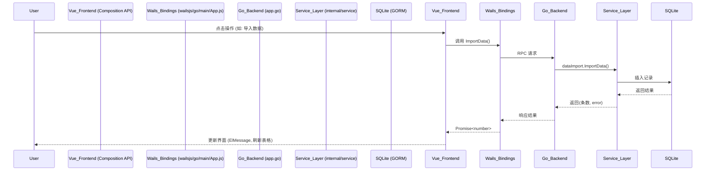

# 设计文档 - 前后端功能联调 (API_Integration)

## 架构概览

### 整体交互流程


## 接口设计 (需补充的 Go 接口)

为支持完整的 UI 展示，在 `app.go` 中补充以下几个接口：

### 1. `GetDashboardStats() DashboardStats`
- **目的**: 为首页概览控制台提供 4 个统计数据。
- **返回结构**:
  ```go
  type DashboardStats struct {
      TotalRecords    int64 `json:"totalRecords"`
      TaggedRecords   int64 `json:"taggedRecords"`
      TotalTags       int64 `json:"totalTags"`
      TotalRules      int64 `json:"totalRules"`
  }
  ```

### 2. `GetTaggedDataList(keyword, tag, batch string, page, pageSize int) (*PagedTaggedData, error)`
- **目的**: 为“打标结果”页面提供带过滤条件的查询。
- **返回结构**:
  ```go
  type PagedTaggedData struct {
      Total   int64                 `json:"total"`
      Records []TaggedRecordDto     `json:"records"`
  }
  ```

## 前端组件绑定策略

1. **`DataSource.vue`**
   - 初始化时调用 `GetRawDataList(1, 20)`
   - 点击上传图标触发 `ImportData("")`，成功后重新加载当前页数据。
2. **`SettingsDialog.vue`**
   - 模态框打开时加载 `GetAppConfig()`
   - 点击保存调用 `SaveAppConfig(config)`
3. **`TagRuleConfig.vue`**
   - 初始化加载 `GetAllTags()`，递归渲染 `el-tree`
   - 规则构建器保存时调用 `SaveRule()`
   - 试运行点击调用 `DryRunRule(ruleJSON, 10)`，并更新试运行表格。
4. **`TaskKanban.vue`**
   - 初始化加载 `GetTaskBatches()`
   - 提交打标表单调用 `RunTaggingTask(ruleIDs, batchName, isPrimary)`
5. **`Dashboard.vue`**
   - 初始化调用新补充的 `GetDashboardStats()`
6. **`TaggedData.vue`**
   - 筛选栏、分页器与表格绑定新补充的 `GetTaggedDataList()`
