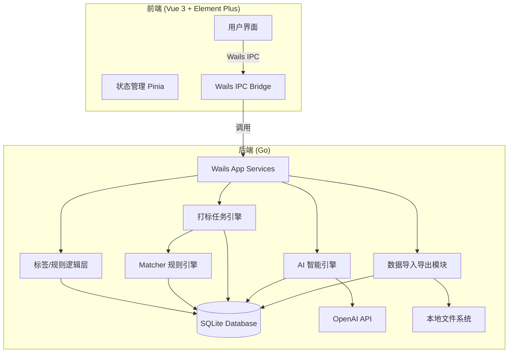

# 架构设计文档 - TagMatrix 数据打标系统

## 1. 架构概览

TagMatrix 是一个基于 Wails 框架构建的本地桌面应用程序，采用典型的前后端分离架构，但前后端代码打包在同一个二进制文件中运行。

### 1.1 整体架构图

### 1.2 核心组件

*   **Wails App Services**: 暴露给前端的 Go 方法集合，负责处理所有的业务请求（如创建标签、触发打标、导入文件等）。
*   **TagLogic (标签与规则管理)**: 负责维护 SQLite 中的 `SysTag` 和 `SysMatchRule` 数据。
*   **TaskEngine (打标任务引擎)**: 核心执行组件。负责读取数据、执行 `matcher` 规则评估、生成 `TagTaskBatch` (任务批次) 和 `TagTaskLog` (审计日志)，并将结果写入 `SysEntityTag`。包含一个基于 Goroutine 的 worker pool 以处理海量数据。
*   **Matcher 规则引擎**: 复用自 NeoScan，无状态的布尔逻辑判定引擎。
*   **AIEngine (AI 引擎)**: 负责与 OpenAI 协议接口通信，执行长尾打标、数据分析和自然语言交互。
*   **DataImportExport (导入导出)**: 处理 Excel/CSV 文件的解析入库，以及最终带标签数据的导出。

## 2. 数据库模型设计 (SQLite + GORM)

为了支撑系统的多维度需求（规则打标、打标模式、版本回退、审计追踪），设计以下核心表结构：

### 2.1 原始数据表 (Raw Data)
*   **`raw_data_records`**: 动态存储用户导入的数据。
    *   `id` (PK, string/uuid)
    *   `batch_id` (导入批次)
    *   `data` (JSONB / Text 存储完整行数据，方便任意字段匹配)
    *   `created_at`

### 2.2 标签与规则定义
*   **`sys_tags`**: 标签定义树 (复用改进)
    *   `id` (PK), `name`, `parent_id`, `path`, `color`, `description`, `created_at`
*   **`sys_match_rules`**: 打标规则
    *   `id` (PK), `tag_id` (关联标签), `name`, `rule_json` (matcher JSON), `priority`, `is_enabled`

### 2.3 任务与审计追踪 (支持回退的核心)
*   **`tag_task_batches`**: 打标任务批次
    *   `id` (PK), `name` (任务名称), `status` (运行中/完成/失败/已回退), `total_processed`, `created_at`, `finished_at`
*   **`tag_task_logs`**: 打标操作审计日志
    *   `id` (PK), `batch_id` (关联任务批次), `record_id` (关联原始数据), `tag_id`, `rule_id` (命中的规则), `reason` (详细匹配过程/AI解释), `action` (add/remove)

### 2.4 实体标签关联 (结果表)
*   **`sys_entity_tags`**: 数据打标结果 (复用改进)
    *   `id` (PK), `record_id` (关联原始数据), `tag_id`, `source` (manual/auto_rule/ai), `is_primary` (bool, 区分混合模式主副标签), `batch_id` (记录是哪个批次打上的，用于回退)

## 3. 核心业务流程设计

### 3.1 规则打标任务流
1. 用户在 UI 选择规则并触发打标。
2. 后端生成一个新的 `TagTaskBatch`。
3. TaskEngine 启动 Goroutine Pool，流式从 `raw_data_records` 读取数据。
4. 将数据转为 JSON 对象传递给 `matcher` 引擎评估。
5. 命中规则后：
   - 插入 `sys_entity_tags` 记录。
   - 插入 `tag_task_logs` 记录。
6. 任务完成，更新 `TagTaskBatch` 状态。

### 3.2 任务回退流 (Rollback)
1. 用户在 UI 选择历史任务批次，点击“回退”。
2. 后端查询 `tag_task_logs` 中属于该 `batch_id` 且 `action=add` 的记录。
3. 批量删除 `sys_entity_tags` 中对应的记录。
4. 将 `tag_task_batches` 状态标记为“已回退”。

### 3.3 AI 对话与生成 SQL 流
1. 提取当前 SQLite 的表结构 (`PRAGMA table_info(...)`)。
2. 构造 System Prompt："你是一个数据分析助手，当前数据库有以下表和字段：[Schema]..."。
3. 接收用户问题（如：“帮我查出打上 A 标签的数据有多少条？”）。
4. 调用 OpenAI API，返回生成的 SQL 或分析结果。

## 4. 前后端 Wails IPC 接口契约

*(在 Wails 中，前端通过直接调用暴露的 Go struct 方法进行通信，以下为 Go 侧暴露的核心方法)*

### 数据管理
*   `ImportData(filePath string) (int, error)`: 导入 Excel/CSV。
*   `ExportData(query string, exportPath string) error`: 导出数据。
*   `GetRawDataList(page, pageSize int) ([]Record, error)`: 分页获取原始数据。

### 标签与规则
*   `CreateTag(tag SysTag) error` / `GetTagTree() ([]SysTag, error)`
*   `SaveRule(rule SysMatchRule) error`
*   `DryRunRule(ruleJSON string, limit int) ([]DryRunResult, error)`: 试运行规则。

### 任务执行与回退
*   `RunTaggingTask(ruleIDs []uint) (batchID string, error)`: 异步触发任务。
*   `GetTaskBatches() ([]TagTaskBatch, error)`
*   `RollbackTask(batchID string) error`: 回退指定任务。

### AI 助手
*   `ChatWithAI(message string) (string, error)`
*   `RunAITaggingTask(recordIDs []string, prompt string) (batchID string, error)`: AI 独立打标。