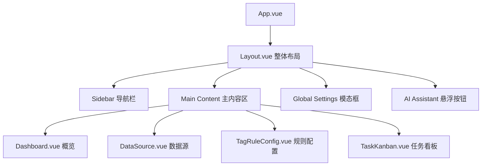

# 设计文档 - 优化 TagMatrix 前端 UI 设计

## 架构概览

### 整体架构图

### 核心组件设计

#### Layout.vue
- **职责**：
  - 渲染左侧宽度固定的 Sidebar（背景色 `#f7f7f9`），包含 Logo、菜单项。
  - 渲染右侧自适应的主内容区，带有各自页面的独立 Header（包含标题、任务状态胶囊、设置图标）。
  - 渲染全局的 Settings 弹窗。
  - 渲染右下角的 AI Assistant 悬浮按钮（绿色圆圈 + 机器人图标）。
- **样式**：
  - 去除之前贯穿全局的顶栏。
  - 主内容区背景为纯白 `#ffffff`，padding 统一为 `24px`。

#### Dashboard.vue
- **职责**：展示四张数据卡片、快速操作按钮和最近任务表格。
- **结构**：
  - 顶部：欢迎语和副标题。
  - 数据区：`el-row` + `el-col`，4个带图标和趋势的数据卡片。
  - 快捷操作区：两个带绿色图标的快速入口卡片。
  - 表格区：`el-table` 显示最近任务，带有不同状态的 tag。

#### DataSource.vue
- **职责**：展示数据源列表和文件上传框。
- **结构**：
  - 顶部工具栏：上传、导出、删除、搜索框、筛选图标。
  - 上传区：一个巨大的虚线边框区域，带有居中的上传图标和绿色选择文件按钮。
  - 数据表：带复选框的 `el-table`，并展示已打标签（多色 pill）。

#### TagRuleConfig.vue
- **职责**：左侧标签树，右侧规则编辑器。
- **结构**：
  - 页面容器为 Flex 布局，左侧定宽，右侧自适应。
  - 左侧：`el-tree` 展示标签层级。
  - 右侧：
    - 标签基本信息表单。
    - 匹配规则列表（包含 AND/OR 切换按钮、每一条规则的具体字段下拉框和 Switch 开关）。
    - 规则测试区：展示匹配率 Alert 框和抽样测试数据表格。

#### TaskKanban.vue
- **职责**：打标任务发起和历史记录。
- **结构**：
  - 顶部表单区：选择数据源、规则、模式等下拉框，和一个“开始执行”按钮。
  - 底部历史区：工具栏（状态过滤、时间过滤），带有进度条（`el-progress`）的任务列表表格。

#### Global Settings (作为单独组件或在 Layout 内实现)
- **职责**：全局设置弹窗。
- **结构**：`el-dialog`，包含 AI 配置、系统设置和高级设置的表单。

## UI 规范定义
在 `main.scss` 中更新 CSS 变量：
- `--tm-bg-sidebar: #f7f7f9`
- `--tm-bg-main: #ffffff`
- `--tm-bg-hover: #e5e5e5`（或更浅的灰色，对应设计图）
- `--tm-accent-primary: #52c48f`
- `--tm-border-radius: 12px`
- 表格头部背景：`#f9fafc`
