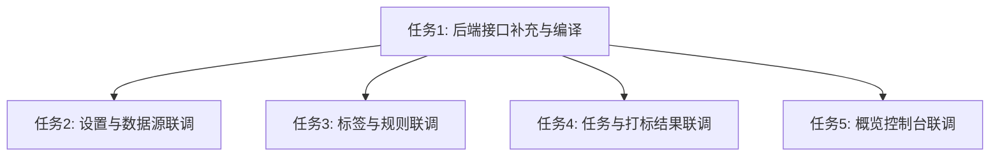

# 任务拆分文档 - 前后端功能联调 (API_Integration)

## 任务列表

### 任务1：后端基础接口补充与编译
- **输入契约**：`DESIGN_API_Integration.md` 中的接口设计
- **输出契约**：
  - `app.go` 补充 `GetDashboardStats` 和 `GetTaggedDataList` 两个接口的定义与空实现（或者基础数据库查询）。
  - 执行 `wails build -m` 或 `wails dev` 生成最新的前端 TypeScript 绑定 (`wailsjs/go/main/App.ts`)。
- **实现约束**：确保生成的 TS 绑定在前端可以直接被导入。

### 任务2：联调全局设置与数据源页面
- **输入契约**：`SettingsDialog.vue`, `DataSource.vue` 和 Wails JS Bindings
- **输出契约**：
  - `SettingsDialog.vue` 可以真实读取和保存 `config.AppConfig`
  - `DataSource.vue` 能够通过 `ImportData` 唤起本地文件选择并导入，表格分页能够读取 `GetRawDataList`
- **实现约束**：加载时显示 `v-loading`，操作后使用 `ElMessage` 提示。

### 任务3：联调标签与规则配置页面
- **输入契约**：`TagRuleConfig.vue`
- **输出契约**：
  - 左侧树形菜单能正确渲染 `GetAllTags()`
  - 右侧规则试运行能够调用 `DryRunRule` 并展示真实命中结果
  - 能够使用 `CreateTag` 创建新标签
- **实现约束**：保持左右分栏的交互状态同步。

### 任务4：联调任务看板与打标结果页面
- **输入契约**：`TaskKanban.vue`, `TaggedData.vue`
- **输出契约**：
  - 看板历史表格展示 `GetTaskBatches()`
  - 发起任务可以调用 `RunTaggingTask`
  - 打标结果页面通过 `GetTaggedDataList` 实现真实的过滤查询
- **实现约束**：处理好分页组件的双向绑定事件。

### 任务5：联调概览控制台
- **输入契约**：`Dashboard.vue`
- **输出契约**：4个统计卡片展示 `GetDashboardStats()` 返回的真实数据。

## 依赖关系图

