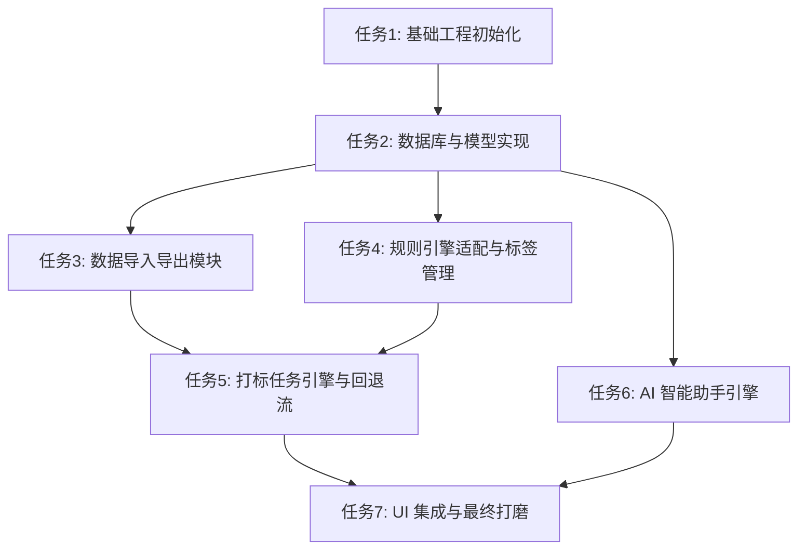

# 任务拆分文档 - TagMatrix 数据打标系统

本阶段将系统架构拆分为可独立开发、测试的原子级任务，以确保复杂度的可控。

## 1. 任务列表

### 任务1：基础工程初始化 (Project Scaffold)
- **输入契约**：Go 1.20+、Node.js 18+ 环境。
- **输出契约**：使用 `wails init` 创建一个基础的 Vue3 + Vite + Go 项目。
- **验收标准**：
  - 成功运行 `wails dev`，出现基础的窗口界面。
  - Vue 前端能成功调用一个默认的 Go AppService 方法（如 Greet）。

### 任务2：核心数据库与模型层实现 (Database & Models)
- **输入契约**：完成任务1，引入 `gorm` 和 `sqlite` 驱动。
- **输出契约**：`internal/model` 目录下的 GORM 实体定义及 SQLite 的初始化逻辑。
- **验收标准**：
  - 程序启动时能自动在本地创建 `data.db` 并在其中创建 `raw_data_records`, `sys_tags`, `sys_match_rules`, `tag_task_batches`, `tag_task_logs`, `sys_entity_tags` 等表。
  - 提供基础的 CRUD 接口并在 Go 的测试用例中验证通过。

### 任务3：数据导入导出模块 (Data Import/Export)
- **输入契约**：完成任务2。
- **输出契约**：在 Wails 中暴露 `ImportData` 和 `ExportData`，使用 Go 处理 CSV/Excel 解析，并批量入库至 `raw_data_records`。
- **验收标准**：
  - 能通过前端点击选择文件（测试 1w+ 行 CSV）。
  - 数据能正确序列化为 JSON 存入 `raw_data_records`。
  - 能够导出包含特定查询条件的数据。

### 任务4：规则引擎适配与标签管理 (Matcher & Tag Management)
- **输入契约**：完成任务2。移植 NeoScan 的 `matcher` 包。
- **输出契约**：前端 Vue 的标签/规则管理页面；后端的 `CreateTag`, `SaveRule` 以及 `DryRunRule`（试运行）API。
- **验收标准**：
  - 成功在前端创建一个树状标签和带有嵌套布尔逻辑的规则。
  - 前端点击“试运行”时，能成功获取 `matcher` 针对部分真实数据的匹配结果而不落盘。

### 任务5：打标任务引擎与回退流 (Task Engine & Rollback)
- **输入契约**：完成任务3、任务4。
- **输出契约**：Go 端的异步打标调度引擎，包括 Worker Pool 设计，以及任务状态记录和 Rollback API。
- **验收标准**：
  - 触发打标任务时，系统能在后台消费 SQLite 数据，评估 `matcher` 规则。
  - 成功生成 `tag_task_batches` 和详细的 `tag_task_logs`，将结果写入 `sys_entity_tags`。
  - 调用 `RollbackTask` API 时，能撤销某次批次的打标结果和日志。

### 任务6：AI 智能助手引擎 (AI Assistant Integration)
- **输入契约**：完成任务2。获取 OpenAI API 密钥。
- **输出契约**：后端的 AI 通信封装；向大模型注入当前 SQLite 的 Table Schema 和表结构上下文。
- **验收标准**：
  - 前端 AI 聊天窗口能收发信息。
  - 能够让 AI 分析当前导入的数据特征，并返回对应的查询 SQL 语句。
  - (可选) 提供特定数据的 AI 独立打标能力。

### 任务7：UI 集成与最终打磨 (UI Integration & Polish)
- **输入契约**：所有后端接口和核心逻辑均已就绪。
- **输出契约**：美观、现代的 Vue3 + Element Plus 界面；前端路由、状态管理 (Pinia) 以及全局异常处理。
- **验收标准**：
  - 从“导入数据” -> “创建标签规则” -> “执行打标” -> “查看日志与回退” -> “导出结果”的端到端业务流在 UI 上走通。

---

## 2. 依赖关系图

