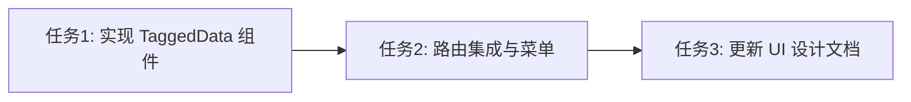

# 任务拆分文档 - 打标结果页面 (TaggedData_View)

## 任务列表

### 任务1：设计并实现 `TaggedData.vue` 页面组件
- **输入契约**：`DESIGN_TaggedData_View.md` 设计规范。
- **输出契约**：前端组件 `frontend/src/views/TaggedData.vue`，包含筛选卡片、数据表格、导出按钮。
- **实现约束**：采用 Element Plus 和组合式 API (Vue 3 Script Setup)，CSS 使用现有全局 SCSS 变量。

### 任务2：路由集成与菜单更新
- **输入契约**：已有路由 `router/index.ts` 及主布局 `Layout.vue`。
- **输出契约**：
  1. `router/index.ts` 中增加 `/tagged-data` 路由，设置 `meta: { title: '打标结果', icon: 'DataBoard' }`。
  2. `Layout.vue` 中引入 `DataBoard` 图标组件并注册。
- **实现约束**：遵循现有路由的 Hash 模式结构。

### 任务3：更新设计文档 `UI_DESIGN.md`
- **输入契约**：现有的 `UI_DESIGN.md`。
- **输出契约**：在 `## 2. 核心页面规划 (Views)` 章节中插入 `2.7. 打标数据看板 (Tagged Data)`，描述该页面的功能与定位。
- **实现约束**：格式保持 Markdown 规范一致。

## 依赖关系图

