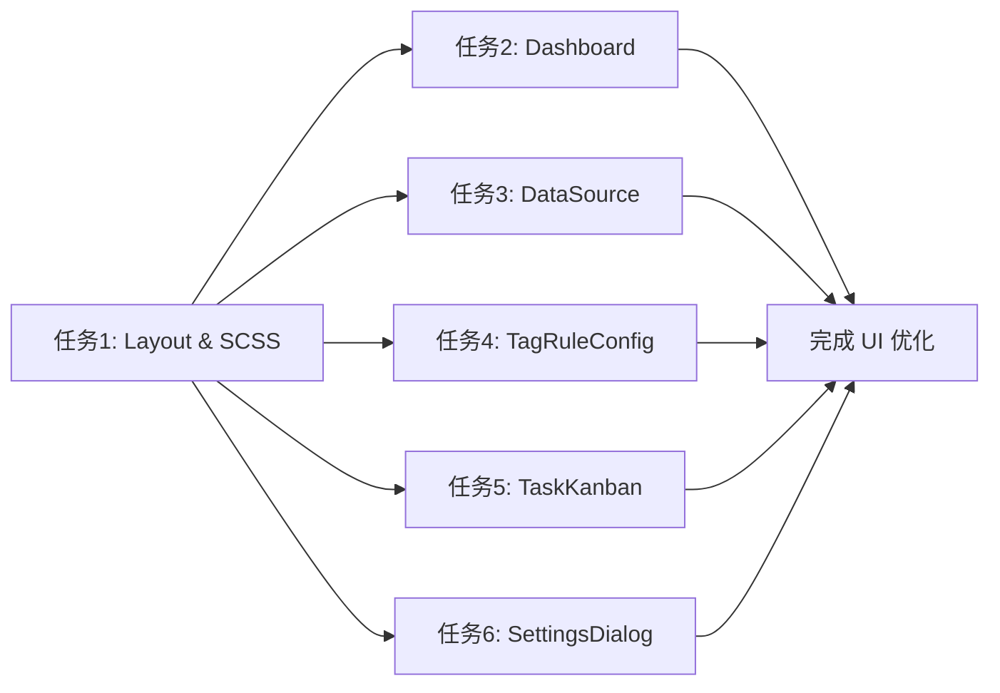

# 任务拆分文档 - 优化 TagMatrix 前端 UI 设计

## 任务列表

### 任务1：基础样式与布局重构 (Layout & SCSS)
#### 输入契约
- 前置依赖：无
- 输入数据：`main.scss`, `Layout.vue`, UI 设计图
#### 输出契约
- 输出数据：更新后的全局 CSS 变量，全新的 `Layout.vue`
- 交付物：
  - 侧边栏背景色变为 `#f7f7f9`。
  - 顶部 Header 移至各个页面内部，或 Layout 仅提供一个右侧内容区的顶部状态栏。
  - 添加右下角悬浮的 AI Assistant 按钮。
  - 添加全局设置的模态框骨架。
- 验收标准：侧边栏样式符合设计图，选中态有灰色背景和加粗文字。右侧内容区背景纯白。

### 任务2：重构概览控制台 (Dashboard.vue)
#### 输入契约
- 前置依赖：任务1
- 输入数据：`Dashboard.vue`, 设计图 `TagMatrix 概览控制台.png`
#### 输出契约
- 交付物：
  - 页面标题区（包含任务状态跑马灯和设置按钮）。
  - 数据统计卡片（4个）和快速操作区（2个）。
  - 最近打标任务表格。
- 验收标准：卡片样式、表格样式与设计图一致，各状态标签颜色正确。

### 任务3：重构数据源管理 (DataSource.vue)
#### 输入契约
- 前置依赖：任务1
- 输入数据：`DataSource.vue`, 设计图 `TagMatrix 数据源管理页面.png`
#### 输出契约
- 交付物：
  - 顶部工具栏（上传、导出、删除、搜索框）。
  - 巨大的虚线框上传区域。
  - 用户行为数据表格（带有不同颜色的标签 pills）。
- 验收标准：虚线框尺寸和内部文字图标符合设计图，表格行数据样式正确。

### 任务4：重构标签与规则配置 (TagRuleConfig.vue)
#### 输入契约
- 前置依赖：任务1
- 输入数据：`TagRuleConfig.vue`, 设计图 `TagMatrix 标签与规则配置页面.png`
#### 输出契约
- 交付物：
  - 左右分栏结构。
  - 左侧：树形标签体系。
  - 右侧：标签基本信息、匹配规则表单（AND/OR切换，条件配置）、试运行测试面板。
- 验收标准：复杂的表单交互和样式与设计图保持一致，尤其是开关、下拉框的排列和测试结果表格。

### 任务5：重构打标任务看板 (TaskKanban.vue)
#### 输入契约
- 前置依赖：任务1
- 输入数据：`TaskKanban.vue`, 设计图 `TagMatrix 打标任务看板页面 2.png`
#### 输出契约
- 交付物：
  - 发起新任务表单区。
  - 任务历史列表（包含状态筛选、时间筛选，以及带进度条的表格）。
- 验收标准：进度条在表格列中正确渲染，按钮和状态标签的颜色与设计图匹配。

### 任务6：实现全局设置面板组件 (SettingsDialog.vue)
#### 输入契约
- 前置依赖：任务1
- 输入数据：设计图 `TagMatrix 全局设置面板.png`
#### 输出契约
- 交付物：
  - 一个完整的 `el-dialog`，包含 AI 配置、系统设置和高级设置的各种表单项（密码框、滑块、开关等）。
- 验收标准：弹窗布局和表单项的排列、颜色与设计图一致。

## 依赖关系图

