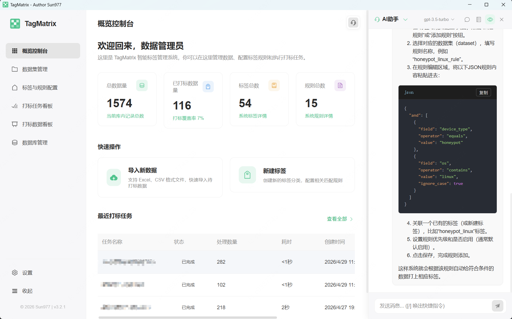
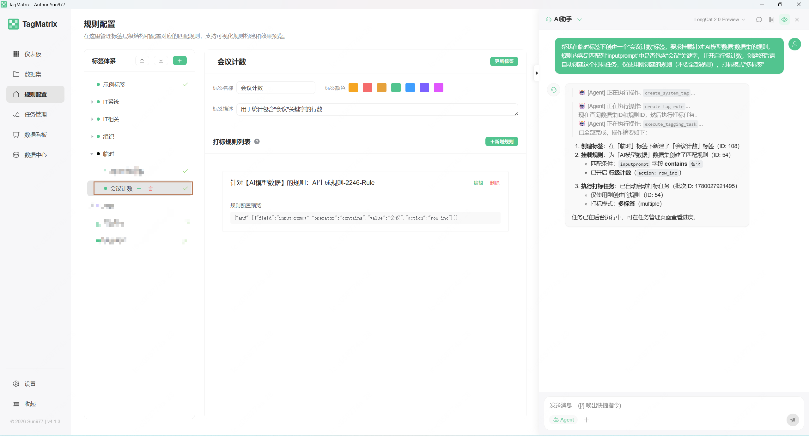
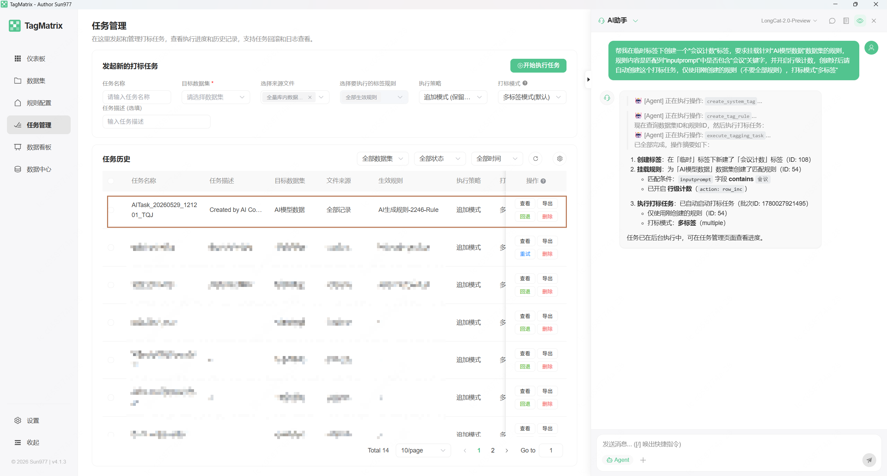
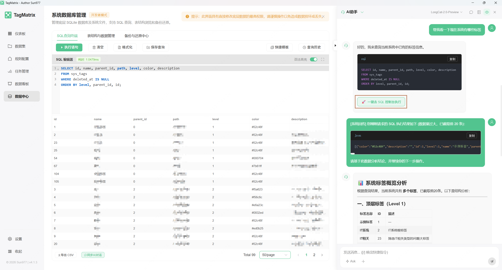
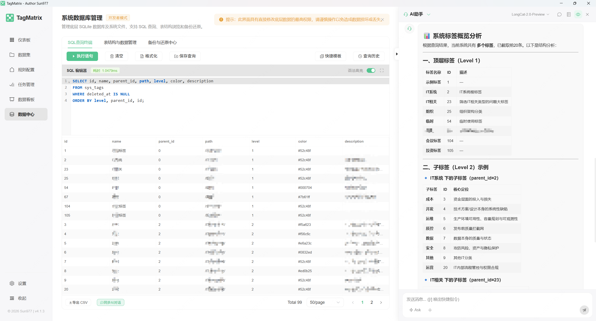

# TagMatrix 用户使用手册

欢迎使用 **TagMatrix**！本手册将帮助您快速了解系统的核心能力，并指导您完成从数据导入到规则配置、执行打标及数据导出的完整流程。

---

## 1. 什么是 TagMatrix？

**TagMatrix** 是一款强大的本地化跨平台数据打标与处理系统。它将海量无序的表格数据（CSV、Excel）通过灵活的规则引擎和 AI 智能辅助，自动转化为带有业务价值的结构化资产。

### 核心能力
- **本地化隐私安全**：基于 SQLite + Wails 本地运行，所有核心业务数据不上传云端，保证数据绝对隐私。
- **异构数据集隔离**：支持导入多份完全不同表头（Schema）的数据集，并分别管理，互不干扰。
- **无极布尔规则引擎**：支持通过可视化界面无限嵌套 `AND/OR` 条件，提供丰富的匹配算子（如包含、等于、大于、正则等）。
- **打标任务与审计回退**：任务执行过程实时可视化，提供详细的打标日志；支持对不满意的任务批次进行“一键回退（Rollback）”。
- **全局智能副驾 (AI Copilot)**：随时唤起大模型助手，感知当前页面上下文，辅助生成 SQL、解析正则、解答疑惑。
- **高级数据开发者工具**：内置 Table Explorer 与原生 SQL Console，供高阶用户直接操控和修正底层数据库。

---

## 2. 核心概念理解

在开始使用前，请了解以下三个核心概念：

- **数据集 (Dataset)**：您导入的每一次 CSV 或 Excel 数据，都会成为一个独立的数据集。它是规则和打标的执行边界。
- **标签 (Tag)**：您要赋予数据的业务标签（如“高潜用户”、“VIP”）。标签是全局存在的业务资产，以树状结构管理。
- **规则 (Rule)**：触发打标的判断条件。**规则是与特定“数据集”强绑定的**。也就是说，针对同一个“高潜用户”标签，在 A 数据集中可能是“消费 > 1000”，在 B 数据集中可能是“登录次数 > 50”。

---

## 3. 快速入门指南

### 步骤一：导入您的数据（数据集）
1. 在左侧导航栏点击 **【数据集】**。
2. 点击 **导入新文件**，选择您的 CSV 或 Excel 文件。
3. 系统会自动解析表头（Schema），并在列表中生成一个新的“数据集”。
4. （可选）您可以点击列表中数据集的 **字段预览** 来检查表头是否解析正确。

### 步骤二：创建标签与配置规则（规则配置）
1. 在左侧导航栏点击 **【规则配置】**。
2. **创建标签**：在左侧标签树区域，点击 **新增标签**，输入标签名称及描述（支持单标签/多标签/主副标签模式）。
3. **绑定数据集**：选中刚创建的标签，在右侧顶部下拉框中**选择目标数据集**。
4. **配置规则算子**：
   - 点击 **添加条件**，系统会自动读取您所选数据集的表头，供您在下拉框中作为判断字段。
   - 选择算子（如：等于、包含、大于等），并填入目标值。
   - 支持添加“规则组”来实现 `(A 且 B) 或 C` 这样的复杂布尔嵌套。
5. **规则试运行 (Dry Run)**：配置完成后，无需直接执行全量任务。您可以点击右上角的 **测试规则**，系统会抽取几条数据进行模拟匹配，告诉您该规则是否合理。
6. **保存规则**。

### 步骤三：执行打标任务（任务执行台）
1. 在左侧导航栏点击 **【仪表板】** 或 **【数据看板】**。
2. 在页面顶部下拉框中 **选中您的目标数据集**。
3. 确认您已经为该数据集配置了规则后，点击 **执行打标任务**。
4. 页面将弹出任务进度面板，实时展示处理进度和耗时。
5. 任务完成后，数据看板中将直接展示新增的系统列：`打标状态`、`命中标签` 等。

### 步骤四：查看结果与导出
1. 在 **【数据看板】** 中，您可以像使用 Excel 一样，使用右上角的过滤、搜索功能，查看已被成功打标的数据。
2. 点击 **导出数据**，系统会帮您将结果生成为您需要的 CSV 文件（支持解决中文乱码的 BOM 输出），您可以继续拿到其他 BI 系统或 Excel 中进行分析。

---

## 4. 高阶功能使用

### 4.1 全局智能副驾 (AI Copilot)
- **唤起方式**：点击页面右上角（或右下角悬浮窗）的 **三角**。
- **核心能力**：
  - **上下文感知交互**：右侧会滑出 AI 对话框。它能**感知您所在的页面**。比如当您在写 SQL 时，您可以直接向它提问：“帮我写一段统计年龄大于18岁的用户数SQL”，AI 将结合您当前的上下文给出精准答案。
  - **自动执行任务**：支持直接通过自然语言对话下发打标等复杂任务，极大简化手动操作流程。
  - **智能数据中心分析**：针对数据中心的数据，AI 不仅可以为您生成并运行 SQL 脚本，还可以对数据进行可视化和逻辑层面的深度智能分析。
- **配置**：在左侧导航底部的 **【设置】 -> 【AI 模型配置】** 中填入您的 OpenAI 或代理 API Key 即可激活。

#### 示例效果展示
**AI 智能问答与辅助生成：**
<p align="center">
  
</p>

**AI 自动执行任务：**
<p align="center">
  
  
</p>

**AI 数据中心 SQL 协助与分析：**
<p align="center">
  
  
</p>

### 4.2 任务审计与回退
- 若您发现打标结果有误，可点击进入 **【任务管理】**。
- 这里记录了所有的历史打标批次。找到错误的批次，点击 **回退任务 (Rollback)**，系统会干净利落地撤销该批次产生的所有标签。

### 4.3 开发者模式：数据中心 (DatabaseAdmin)
- **开启方式**：进入 **【设置】** -> **【高级与系统】**，开启 **开发者模式**（点击“开发者模式”5次后解锁开关）。
- 开启后，左侧导航底部会出现 **【数据库管理】** 菜单。
- **功能**：
  - **SQL Console**：提供原生的 SQL 执行终端，您可以直接对 SQLite 数据库敲 `SELECT` 等语句。
  - **Table Explorer**：以表格形式可视化浏览和修改底层物理表或 JSON 业务字段。
  - **安全备份**：执行高危操作前，请先在备份页面对 `.db` 数据库文件生成快照备份，防患于未然。

### 4.4 匹配引擎高阶使用场景 (Matcher Scenarios)
TagMatrix 底层内置了高性能的上下文匹配引擎。为了满足各种复杂的业务需求，您可以在 JSON 源码模式下编写规则。以下是 6 个典型的实战配置场景：

#### 场景 1：基础布尔逻辑匹配
**需求**：单纯判断设备类型是 `honeypot` 且系统包含 `linux`，不产生任何副作用。
```json
{
  "and": [
    {
      "field": "device_type",
      "operator": "equals",
      "value": "honeypot"
    },
    {
      "field": "os",
      "operator": "contains",
      "value": "linux"
    }
  ]
}
```

#### 场景 2：单字段频次挖掘 (普通算子外挂 Action)
**需求**：判断 `content` 字段是否包含“高价值”，不仅要判断是否匹配，还要记录在这一行数据中“高价值”出现了几次（触发副作用，自动累加到上下文计数器中）。
```json
{
  "field": "content",
  "operator": "contains",
  "value": "高价值",
  "action": "row_inc",
  "ignore_case": false
}
```

#### 场景 3：正则模式频次挖掘 (普通算子外挂 Action)
**需求**：提取 `error_log` 字段中所有符合 `failed_login_\d+` 模式的错误记录，计算其出现的次数，并在上下文中累加。
```json
{
  "field": "error_log",
  "operator": "regex",
  "value": "failed_login_\\d+",
  "action": "row_inc"
}
```

#### 场景 4：非文本复合条件的强制计数 (row_inc / global_inc)
**需求**：如果“账户余额 > 10000”且“状态为 active”，则业务判定成立，此时需无条件触发计数（行级+1，也可配合 global_inc）。利用 `AND` 前置遇假短路的特性，仅当真实条件满足时，最后一步的 `row_inc` 才会执行并产生副作用。
```json
{
  "and": [
    {
      "field": "balance",
      "operator": "greater_than",
      "value": 10000
    },
    {
      "field": "status",
      "operator": "equals",
      "value": "active"
    },
    {
      "operator": "row_inc",
      "value": 1
    }
  ]
}
```

#### 场景 5：多特征叠加计数 (evaluate_all)
**需求**：黑名单IP、异地登录、正则报错，只要满足任意一个就计 1 次。若一行数据同时满足这 3 个特征，希望叠加计数（计 3 次）。此时利用 `evaluate_all` 避免被常规的 `OR` 提前短路。
```json
{
  "evaluate_all": [
    {
      "and": [
        {"field": "ip", "operator": "in", "value": ["1.1.1.1", "2.2.2.2"]},
        {"operator": "row_inc", "value": 1}
      ]
    },
    {
      "and": [
        {"field": "login_location", "operator": "equals", "value": "异地"},
        {"operator": "row_inc", "value": 1}
      ]
    },
    {
      "field": "error_log",
      "operator": "regex",
      "value": "failed_login",
      "action": "row_inc"
    }
  ]
}
```

#### 场景 6：复杂的风控计分卡模型 (evaluate_all + 独立权重)
**需求**：假设需要给一个【高危用户】打标签，规则不仅仅是满足一条就打标，而是根据触发的不同风险行为累加不同的风险分数（如异地登录记2分，改手机记5分）。最后累加看这个用户总计多少次。此时最外层使用 `evaluate_all`，里面挂载 `and` 逻辑组，在每个组最后挂载一个独立的 `row_inc` 算子，并将 `value` 设定为该项对应的风险得分：
```json
{
  "evaluate_all": [
    {
      "and": [
        { "field": "login_status", "operator": "equals", "value": "异地" },
        { "field": "", "operator": "row_inc", "value": 2 }
      ]
    },
    {
      "and": [
        { "field": "pwd_error", "operator": "equals", "value": "true" },
        { "field": "", "operator": "row_inc", "value": 1 }
      ]
    },
    {
      "and": [
        { "field": "action", "operator": "equals", "value": "change_phone" },
        { "field": "", "operator": "row_inc", "value": 5 }
      ]
    }
  ]
}
```

---

## 5. 最佳实践建议

1. **先洗数据，后打标**：虽然 TagMatrix 很强大，但如果在源头将多张表 Join 好，变成大宽表后再导入，打标过程会更加顺畅。
2. **善用试运行 (Dry Run)**：对于包含正则或复杂嵌套的规则，请务必先“试运行”，确保算子逻辑符合预期再执行。
3. **保持标签树简洁**：标签是全局的。请把业务共性的标签建在全局树上，然后利用“选择不同数据集”来分发不同的判断规则。

---
*TagMatrix - 使数据打标如矩阵般精密，如呼吸般自然。*