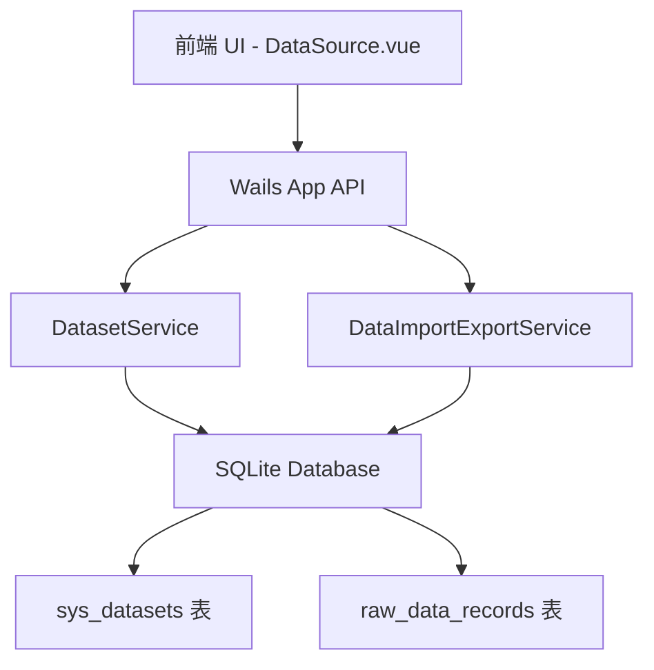

# 设计文档 - Phase 1: 基础设施与数据源管理重构

## 架构概览

### 整体架构图


### 核心组件

#### 1. 数据库模型 (Model)
- **`SysDataset`**: 新增数据集实体。
  - `ID`: uint64
  - `Name`: string
  - `Description`: string
  - `SchemaKeys`: string (JSON 序列化后的表头字段)
- **`RawDataRecord`**:
  - 新增 `DatasetID uint64` 外键。
  - 修改原有隐式的“数据来源”逻辑，强制依赖 `DatasetID`。
- **`TagTaskBatch`, `SysMatchRule`** 等表：
  - 新增 `DatasetID uint64`。

#### 2. 服务层 (Service)
- **`DatasetService`**:
  - `CreateDataset(name, desc string) (*SysDataset, error)`
  - `UpdateDataset(id, name, desc string) error`
  - `DeleteDataset(id uint64) error`
  - `ListDatasets() ([]SysDataset, error)`
  - `GetDataset(id uint64) (*SysDataset, error)`
- **`DataImportExportService`**:
  - `ImportData(filePath string, datasetID uint64, isNew bool, newDatasetName string) error`

#### 3. 前端展示层 (Frontend)
- **左右分栏布局 (`DataSource.vue`)**:
  - 左侧 `<el-aside>`: 渲染数据集列表（使用 `el-menu` 或 `el-list`）。
  - 右侧 `<el-main>`: 渲染所选数据集的 `raw_data_records`，包含动态表头。
- **新建/导入弹窗**:
  - 允许选择已有数据集，或输入新数据集名称。

## 接口设计

### API规范 (Wails `app.go`)
- `ListDatasets() ([]model.SysDataset, error)`
- `CreateDataset(name, description string) (*model.SysDataset, error)`
- `UpdateDataset(id uint64, name, description string) error`
- `DeleteDataset(id uint64) error`
- `ImportData(filePath string, datasetID uint64, newDatasetName string) error`
- `GetRawDataList(datasetID uint64, page, pageSize int, keyword string) (map[string]interface{}, error)`: 分页查询时必须带上 `datasetID`。

## 数据模型

### 实体设计
```go
// SysDataset 数据集管理表
type SysDataset struct {
	BaseModel
	Name        string `json:"name" gorm:"size:100;not null;uniqueIndex;comment:数据集名称"`
	Description string `json:"description" gorm:"size:255;comment:描述"`
	SchemaKeys  string `json:"schema_keys" gorm:"type:text;comment:JSON格式的表头字段数组"`
}

// 修改 RawDataRecord
type RawDataRecord struct {
	BaseModel
	DatasetID uint64         `json:"dataset_id" gorm:"index;not null;comment:关联的数据集ID"`
	BatchID   uint64         `json:"batch_id" gorm:"index;comment:导入时的批次 ID"`
	Data      string         `json:"data" gorm:"type:text;comment:动态列数据 (建议存储 JSON 字符串)"`
	DeletedAt gorm.DeletedAt `json:"-" gorm:"index;comment:软删除时间"`
}
```
