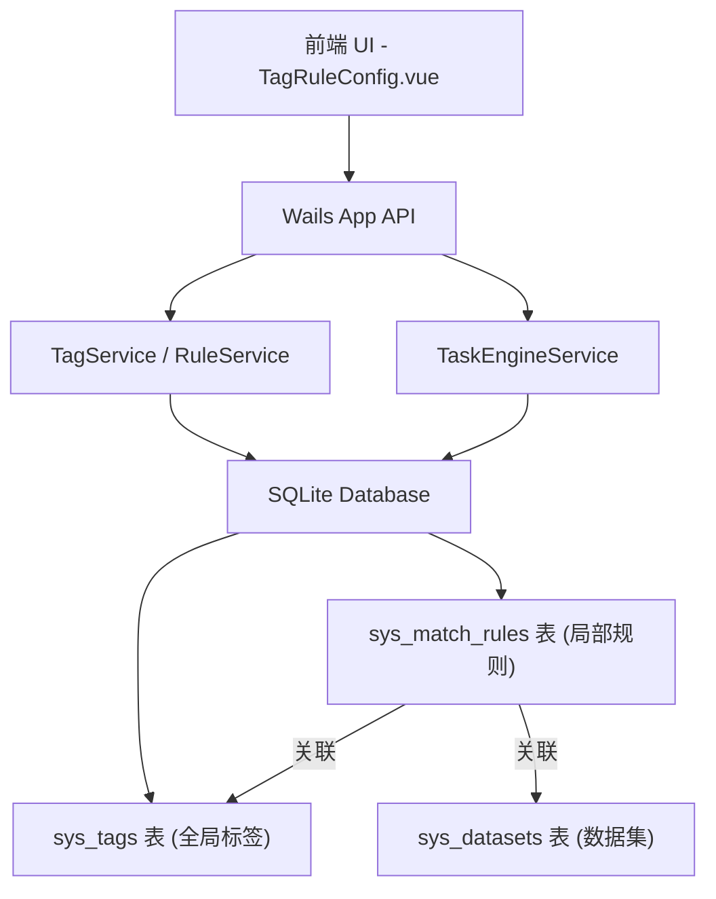

# 设计文档 - Phase 2: 标签与规则配置中心重构 (核心挑战)

## 架构概览

### 整体架构图


### 核心组件

#### 1. 数据库模型 (Model)
- **`SysMatchRule`**:
  - `ID`: uint64
  - `TagID`: uint64 (关联到 `sys_tags.id`)
  - `DatasetID`: uint64 (新增，关联到 `sys_datasets.id`)
  - `Name`: string
  - `RuleJSON`: string (匹配逻辑)
  - `IsEnabled`: bool
  - `Priority`: int
  - **联合唯一索引**: `UNIQUE(tag_id, dataset_id)`。确保一个标签在一个数据集中只有唯一一套判定规则（内部包含复杂的 JSON 判定树）。

#### 2. 服务层 (Service)
- **`RuleService`**:
  - `SaveRule(rule *model.SysMatchRule) error`: 保存规则，必须验证 `TagID` 和 `DatasetID` 存在。
  - `GetRulesByTagAndDataset(tagID uint64, datasetID uint64) (*model.SysMatchRule, error)`: 按标签和数据集获取规则。
  - `GetRulesByDataset(datasetID uint64) ([]model.SysMatchRule, error)`: 打标任务引擎使用的批量拉取接口。
  - `GetRulesByTag(tagID uint64) ([]model.SysMatchRule, error)`: 供配置页面拉取该标签下**所有**数据集配置的规则。

- **`TaskEngineService`**:
  - 修改 `RunTaggingTask`，将 `dataset_id` 传递给底层引擎。
  - 引擎拉取规则时，使用 `GetRulesByDataset(datasetID)` 过滤出目标专属规则。

#### 3. 前端展示层 (Frontend)
- **`TagRuleConfig.vue` 视图重构**:
  - 左侧 `<el-tree>`: 全局标签树，保留“带有规则”的直观对勾提示。
  - 右侧工作区: 使用 `el-card` 分组展示：
    - `v-for="rule in rules"`
    - 标题显示：`针对【{{ rule.DatasetName }}】的打标规则`
  - 新建/编辑规则弹窗 (`ruleDialogVisible`):
    - 新增“目标数据集” `<el-select>`，基于 `ListDatasets` 加载。
    - 选定数据集后，加载其 `schema_keys`，动态渲染到“条件字段”的下拉列表中。
    - 将算子说明（小问号）移至更符合用户视觉动线的“新增规则”按钮旁。
- **`Dashboard.vue` 概览控制台优化**:
  - 为【数据总量】、【已打标数据量】、【规则总数】增加下钻分析弹窗 (`el-dialog`)。
  - 数据总量/已打标数据量：通过接口汇聚按数据集维度分组的条数和打标比例。
  - 规则总数：在列表视图中新增一列“所属数据集” (`DatasetName`) 供溯源查看。

#### 4. 健壮性与隔离机制 (Refinements)
- **标签层级防腐**: `UpdateTag` 引入事务。更新名称后，必须重算节点自身路径，并通过 `LIKE` 批量替换所有关联子标签的前缀路径，以防树结构断裂。
- **系统保留字段前缀隔离**: 为避免内部逻辑（如“来源文件”）与用户上传的真实数据字段名（如恰好叫“数据来源”或“来源文件”）产生碰撞，我们在底层 JSON 中注入系统保留字段时，强制增加 `TagM_` 前缀，即 `TagM_sourceFile`。
  - 前端界面与导出的表头会通过特定的映射函数，将其“洗回”对用户友好的 `来源文件`。
  - 数据查询引擎 (`JSON_EXTRACT`) 将明确使用 `TagM_sourceFile` 进行条件匹配。

## 接口设计

### API规范 (Wails `app.go`)
- `GetRulesByTag(tagID uint64) ([]model.SysMatchRule, error)`
- `SaveRule(rule model.SysMatchRule) error`
- `DeleteRule(id uint64) error`

## 数据模型

### 实体设计
```go
// 修改 SysMatchRule
type SysMatchRule struct {
	BaseModel
	TagID      uint64 `json:"tag_id" gorm:"uniqueIndex:idx_tag_dataset;not null;comment:关联的标签ID"`
	DatasetID  uint64 `json:"dataset_id" gorm:"uniqueIndex:idx_tag_dataset;not null;comment:关联的数据集ID"`
	Name       string `json:"name" gorm:"size:100;not null;comment:规则名称"`
	RuleJSON   string `json:"rule_json" gorm:"type:text;comment:规则条件的JSON表示"`
	IsEnabled  bool   `json:"is_enabled" gorm:"default:true;comment:是否启用"`
	Priority   int    `json:"priority" gorm:"default:0;comment:优先级，数字越大优先级越高"`
}
```