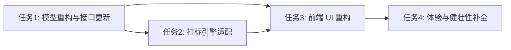

# 任务拆分文档 - Phase 2: 标签与规则配置中心重构 (核心挑战)

## 任务列表

### ✅ 任务1：后端模型重构 (`SysMatchRule`) 与服务接口更新
#### 输入契约
- 环境依赖：现有的 SQLite (GORM)
- 输入数据：`internal/model/models.go`

#### 输出契约
- `sys_match_rules` 新增 `DatasetID` 字段，并建立 `UNIQUE(tag_id, dataset_id)`。
- 重构 `internal/service/tag/rule_service.go` 的 `SaveRule`、`GetRulesByTag` 逻辑。
- 确保 `app.go` 导出 Wails API，包含 `GetRulesByTag` 和 `SaveRule` 的最新签名。

### ✅ 任务2：打标引擎 (`TaskEngineService`) 适配规则隔离
#### 输入契约
- 前置依赖：任务1完成

#### 输出契约
- `internal/service/taskengine/taskengine_service.go` 及其内部 `rule_matcher.go`，不再拉取全局规则，而是按当前任务绑定的 `DatasetID`，调用 `GetRulesByDataset` 或在拉取时增加 `dataset_id` 过滤。

### ✅ 任务3：前端 `TagRuleConfig.vue` 视图重构 (Vue3)
#### 输入契约
- 前置依赖：任务1、任务2的 Wails API

#### 输出契约
- 恢复左侧标签树上旧的规则对勾图标，让规则配置更直观。
- 调整“算子说明”小问号位置到“新增规则”按钮旁，符合操作直觉。
- 右侧工作区实现按数据集分组的规则卡片展示。
- 规则配置弹窗：
  - 新增 `DatasetID` 选框。
  - 基于所选 `Dataset` 加载 `schema_keys`，动态提供条件字段。
- 调用 Wails 的新 `SaveRule` 接口保存规则。

### ✅ 任务4：Phase 2 体验与健壮性补全 (Refinements)
- **前端 Dashboard 重构**:
  - 实现统计卡片的点击事件。
  - 增加分别展示数据集数据量、打标进度及规则所属数据集的弹窗视图 (`el-dialog`)。
- **后端模型防冲突**:
  - “数据来源”全面重命名为“来源文件”，并应用 `TagM_sourceFile` 以避免 JSON 内系统字段与用户表头发生命名冲突。
  - 在底层 JSON_EXTRACT 及导出映射中应用此逻辑。
- **标签树一致性修复**:
  - 重写 `taglogic_service.go` 的 `UpdateTag` 函数，引入事务机制。
  - 修改标签名称时，重构其 `path`，并向后级联更新该节点下所有子节点的 `path` 字段。
- **UI Bug 修复**:
  - 修复 `TaskKanban.vue` 缺失 `QuestionFilled` 图标的 Linter 错误。

## 依赖关系图
