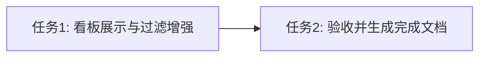

# 任务拆分文档 - Phase 3: 打标任务引擎与看板改造

## 任务列表

### 任务1：补齐前端打标看板的历史过滤与展示

#### 输入契约
- 现有的 `TaskKanban.vue`。
- 已获取的 `availableDatasets` 响应式列表。
- `TagTaskBatch` 返回的 `dataset_id`。

#### 输出契约
- **新增过滤条件**：
  - 在 `.header-filters` 区域新增一个 `el-select`，绑定 `filterDataset`。
  - 选项包含 `all`（全部数据集）及 `availableDatasets` 的所有项。
- **扩展计算属性 `filteredTaskHistory`**：
  - 添加 `filterDataset` 的筛选逻辑：若不为 `all`，则仅保留 `task.datasetId === filterDataset` 的数据。
- **新增表格展示列**：
  - 在“任务名称”和“状态”之间插入“目标数据集”列。
  - 显示值为通过 `datasetId` 查找对应的 `datasetName`。
- **重置分页**：
  - 监听 `filterDataset`，变化时 `currentPage` 重置为 1。

### 任务2：验收 Phase 3 并生成验收与完成文档
- 执行完毕后进行前后端联合验收，完成 `ACCEPTANCE_Phase3.md`。

## 依赖关系图

