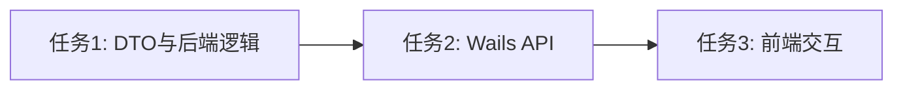

# 任务拆分文档 - 局部资产导出导入

## 任务列表

### 任务1：定义导出导入 DTO 与服务层接口
- **描述**：在 `model` 增加 `ExportDatasetWithRules` 和 `ExportRule` 的结构体；并在 `dataset` 服务下新建 `dataset_export_service.go`，实现后端 `ExportDatasetWithRules` 和 `ImportDatasetWithRules` 方法。
- **输入契约**：数据库表 `sys_datasets`, `sys_tags`, `sys_match_rules`
- **输出契约**：`ExportDatasetWithRules` 能将 `dataset_id` 的所有规则和数据集信息组装为 JSON 写入文件；`ImportDatasetWithRules` 能读取并创建/更新数据集，根据 `TagPath` 创建/更新打标规则。
- **验收标准**：后端单元测试通过，能成功导出/导入 `dataset_with_rules.json`。

### 任务2：接入 Wails App 层
- **描述**：在 `app.go` 暴露 `ExportDatasetWithRules` 和 `ImportDatasetWithRules` 方法，供前端调用。
- **输入契约**：使用 `runtime.SaveFileDialog` 和 `runtime.OpenFileDialog` 获取用户选择的文件路径。
- **输出契约**：返回导出成功与否的提示，以及导入的结果对象 (包含导入/跳过的规则数)。

### 任务3：前端【数据集管理】界面适配
- **描述**：修改 `DataSource.vue` 中的数据集列表卡片（在编辑/删除旁边增加一个“导出”按钮）；在顶部操作区增加一个“导入业务资产”按钮。
- **输入契约**：前端调用新的 Wails 接口。
- **输出契约**：
  - 点击“导出”：触发 `ExportDatasetWithRules`，展示 `ElMessage.success`。
  - 点击“导入业务资产”：触发 `ImportDatasetWithRules`，展示导入结果 `ElMessage.success` (提示导入了多少规则，跳过了多少标签不存在的规则)。
  - 导入完成后刷新数据集列表。
- **验收标准**：完整的全栈交互流程畅通。

## 依赖关系图

