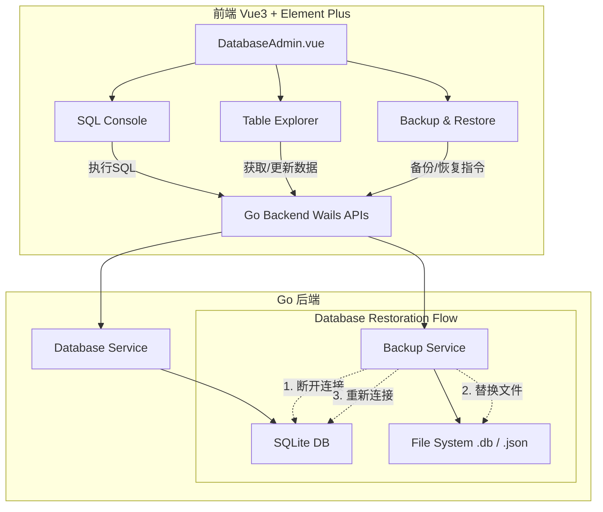

# 设计文档 - DatabaseAdmin系统数据库管理

## 架构概览

### 整体架构图


### 核心组件

#### 1. SQL 查询终端组件 (SqlConsole.vue)
- 职责：提供基于 `vue-codemirror` 的 SQL 输入框、快捷片段面板、以及执行按钮，并使用 `el-table` 动态渲染多态结果集。
- 接口：调用 `ExecuteRawSQL(query)` 返回受影响行数或行数据字典数组。
- 依赖：`vue-codemirror`。

#### 2. 可视化表结构管理组件 (TableExplorer.vue)
- 职责：分为物理表和业务 JSON 数据集两种模式展示，提供对应记录的增删改查。
- 接口：
  - `GetSystemTables()`
  - `GetTableData(tableName, offset, limit)`
  - `UpdateTableRecord(tableName, id, data)`
  - `GetVirtualDatasetData(datasetId, offset, limit)`
  - `UpdateVirtualRecord(datasetId, recordId, jsonPayload)`
- 依赖：Element-Plus Table/Pagination。

#### 3. 备份与还原组件 (BackupRestore.vue)
- 职责：展示备份快照列表，执行一键备份及应用高危还原覆盖。
- 接口：
  - `ListBackups()`
  - `CreateBackup(note)`
  - `RestoreDatabase(backupId/Path)`
- 依赖：Wails 的 `WindowReload` 和原生文件对话框。

## 接口设计

### API规范 (Go 端 Wails 方法)

1. **`ExecuteRawSQL(query string) (RawSQLResult, error)`**
   - 请求：`query` 为原始 SQL 字符串。
   - 响应：
     ```go
     type RawSQLResult struct {
         Columns []string
         Rows    []map[string]interface{}
         Affected int64
         Duration string
         IsSelect bool
     }
     ```
   - 错误处理：抛出 SQLite 语法错误给前端弹窗。

2. **`UpdateVirtualRecord(recordId int64, partialUpdate map[string]interface{}) error`**
   - 请求：提供记录的 ID 及需要更新的 JSON 字段键值对。
   - 逻辑：后端先取出原有 `data` 字段，执行 JSON 反序列化，与 `partialUpdate` 合并，再序列化并执行 `UPDATE`。这保证了其他未修改字段不会被丢弃。

3. **`RestoreDatabase(backupFilename string) error`**
   - 请求：提供备份文件的名称或绝对路径。
   - 逻辑：
     1. 加排它锁。
     2. 调用内部的 `db.Close()`。
     3. 使用 `io.Copy` 将备份文件覆盖当前的 `app.db`。
     4. 重新初始化 `db.Open()`。
     5. 返回成功。前端收到成功后执行重载操作（或者后端直接通知 Wails 重载）。

## 数据模型

### 实体设计
因为是对现有数据库进行管理，不引入新的系统业务表。但可能需要为备份管理引入一个简单的目录扫描机制（直接读取约定好格式的 `.db` 文件及其修改时间，或创建一个小型的 `sys_backups` 索引表用于记录备注信息）。
建议：在配置目录创建 `backups` 文件夹，并采用 `sys_backups` 表或直接文件系统映射来管理。
