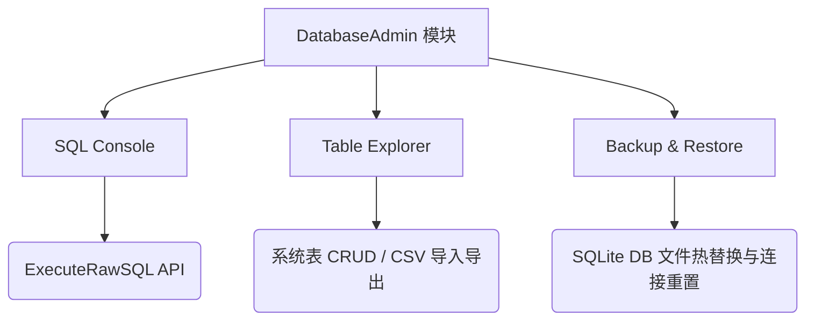

# 架构实现文档 - DatabaseAdmin系统数据库管理

## 模块概述
本模块作为 TagMatrix 的高级开发者模式功能，为数据分析师和系统管理员提供对底层 SQLite 数据库的全面控制能力。包含三大核心能力：SQL 查询终端、可视化表结构与数据管理、备份与还原中心。

## 核心实现结构

### 1. 前端基础骨架与代码编辑器 (SQL Console)
- **技术选型**：引入 `vue-codemirror` 和 `@codemirror/lang-sql`。
- **功能特性**：
  - 提供高亮 SQL 编辑环境，具备深度定制的语法高亮（加粗配色）。
  - 支持常用 SQL Snippets（模板）的一键插入，便于处理基于 `json_extract` 的复杂查询。
  - 支持执行结果的分页浏览，以及直接导出为 CSV（含 BOM 头及特殊字符转义处理）。
- **布局设计**：通过 `min-height: 0` 和绝对定位 `position: absolute`，确保在海量数据查询时结果表格不会撑破父容器。

### 2. 后端 SQL 终端接口与执行解析
- **API 接口**：Go 端实现 `ExecuteRawSQL` 接口。
- **执行逻辑**：
  - 针对 `SELECT` 语句：动态解析列名，返回有序的表头及行数据（Map/List 结构），保障结果呈现的稳定性。
  - 针对 `UPDATE/DELETE`：返回受影响行数与耗时。
  - 通过严格的 `Rows.Close()` 闭环管理，避免连接泄露和数据库锁死。

### 3. 可视化表结构与数据管理 (Table Explorer)
- **双模式切换**：支持物理表和逻辑业务数据集的管理。
- **物理表 CRUD**：
  - 支持对 `sys_tables` 及各类元数据表的直观内联双击编辑。
  - 前后端均做数据清洗拦截：针对新增行和导入 CSV 数据，自动忽略 `id` 和 `created_at`、`updated_at` 等时间戳系统字段（在 Go 端由后端动态注入时间戳），避免 GORM 钩子失效导致的数据异常。
- **导入导出**：支持标准 CSV 文件的导入（前端预处理过滤）和导出（含完整业务字段）。

### 4. 备份与还原中心 (Backup Restore)
- **备份策略**：放弃基于数据库表记录备份元数据，采用扫描物理文件夹并解析文件名的健壮方案（防主库损坏导致无法读取备份列表）。
- **热重启还原机制**：
  - 断开连接：触发还原时，Go 端强行关闭当前所有 GORM 连接。
  - 文件覆盖：使用快照文件覆盖现有的 `data.db`。
  - 实例重启：重新调用后端的 `startup()` 或者重置 Service 实例，完成热重启。
- **UI 交互**：通过前端事件总线发出通知，全局触发 Vue Router 的平滑退场跳转，实现丝滑重启体验，避免生硬的 `location.reload()`。

## 模块依赖关系

