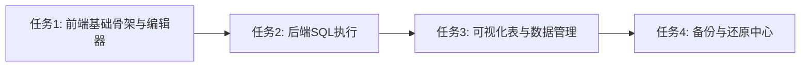

# 任务拆分文档 - DatabaseAdmin系统数据库管理

## 任务列表

### 任务1：[前端基础骨架搭建与代码编辑器集成]
#### 输入契约
- 前置依赖：无
- 输入数据：全局配置
- 环境依赖：引入 `vue-codemirror` 和 `@codemirror/lang-sql`

#### 输出契约
- 输出数据：配置侧边栏路由，开发者模式的显隐控制
- 交付物：
  - `DatabaseAdmin.vue` 布局框架（Tabs 切换：SQL/Table/Backup）。
  - `SqlConsole.vue` 子组件包含高亮的 `vue-codemirror` 编辑器和结果空态。
- 验收标准：仅在“开发者模式”下可见该入口，并能切换 Tab。

#### 实现约束
- 技术栈：Vue3 / Element Plus
- 质量要求：页面无报错，编辑器输入不卡顿。

### 任务2：[后端 SQL 终端接口与执行解析]
#### 输入契约
- 前置依赖：无
- 输入数据：前端发送的原始 SQL。
- 环境依赖：现有的 SQLite 连接。

#### 输出契约
- 输出数据：返回包含列名、行数据（Map/List 结构）、受影响行数的 `RawSQLResult`。
- 交付物：Go `ExecuteRawSQL` API。
- 验收标准：执行 SELECT 返回行列数据，UPDATE/DELETE 返回受影响行数；执行错误返回错误提示。

#### 实现约束
- 接口规范：返回的列名顺序要稳定。
- 质量要求：做好资源关闭（Rows.Close() 等）。

### 任务3：[前后端联调 - 可视化表结构与数据管理]
#### 输入契约
- 前置依赖：现有 `sys_tables` 查询与 `sys_datasets` 逻辑。
- 输入数据：物理表名、分页信息；或者数据集 ID。
- 环境依赖：基础数据库表、`raw_data_records` 中的 `data` JSON 字段。

#### 输出契约
- 交付物：
  - 后端：获取系统表及虚拟表的通用接口；支持通过 ID 增量更新 JSON 的 `UpdateVirtualRecord`。
  - 前端：`TableExplorer.vue`，实现左侧表列表，右侧基于 `el-table` 的动态数据列渲染及双击内联编辑组件。
- 验收标准：能显示物理表并提供编辑；能将 `data` JSON 打平为多列显示，用户编辑某一列时仅更新该 JSON key。

#### 实现约束
- 技术栈：Go / Vue3
- 质量要求：不要因为内联编辑覆盖了未展示的其他 JSON 字段。

### 任务4：[备份与还原中心]
#### 输入契约
- 前置依赖：文件系统的读写操作。
- 环境依赖：应用的 Go DB 驱动及锁定机制。

#### 输出契约
- 输出数据：备份列表。
- 交付物：
  - 后端：`ListBackups`, `CreateBackup`, `RestoreDatabase` 接口（断开、覆盖、重连）。
  - 前端：`BackupRestore.vue` 面板，包括警告弹窗，成功恢复后的 `WindowReload` 调用。
- 验收标准：用户能创建带备注的备份，点击恢复并确认后，Go 端关闭 DB、替换文件、重启连接，前端页面刷新。

#### 实现约束
- 质量要求：严格保证 `RestoreDatabase` 期间没有文件锁争用，必须显式调用 `db.Close()`。

## 依赖关系图

