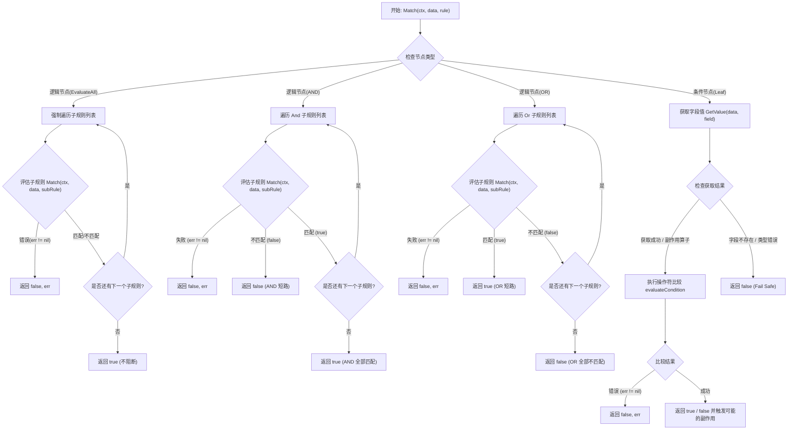

# Matcher 通用匹配引擎

## 1. 简介
`matcher` 是一个高性能、带有状态和副作用的上下文匹配引擎 (Context-Aware Matcher)，支持记录特征出现频次。它负责评估一组条件（Condition）针对给定的数据（Data）是否成立。
通过注入上下文 (Context)，引擎可以在匹配过程中产生副作用（如行级计数、全局计数），非常适用于需要多频次挖掘和叠加统计的打标与数据分析场景。

## 2. 核心数据结构

为了支持复杂的嵌套逻辑（如 `(A AND B) OR (C AND D)`），我们采用递归结构设计。

### 2.1 MatchRule (匹配规则)
`MatchRule` 是规则树的基本单元，它既可以是单纯的**条件节点（Leaf）**，也可以是包含子规则的**逻辑节点（Branch）**。

```go
type MatchRule struct {
    // --- 逻辑节点 (Branch) ---
    // 逻辑节点包含子规则列表。
    // 如果设置了 And，则所有子规则都必须匹配。
    // 如果设置了 Or，则任意子规则匹配即可。
    // 如果设置了 EvaluateAll，则强制执行所有子规则（非短路），用于副作用叠加。
    And         []MatchRule `json:"and,omitempty"`
    Or          []MatchRule `json:"or,omitempty"`
    EvaluateAll []MatchRule `json:"evaluate_all,omitempty"`

    // --- 条件节点 (Leaf) ---
    // 当逻辑字段为空时，该节点被视为条件节点，必须包含以下字段：
    Field    string      `json:"field,omitempty"`    // 待匹配字段名 (支持点号访问嵌套字段，如 "meta.os")
    Operator string      `json:"operator,omitempty"` // 操作符
    Value    interface{} `json:"value,omitempty"`    // 目标值
    IgnoreCase bool      `json:"ignore_case,omitempty"` // 是否忽略大小写
}
```

## 3. 支持的操作符 (Operators)

目前支持多种基础与副作用操作符：

| 操作符 | 说明 | 适用类型 | 示例 |
| :--- | :--- | :--- | :--- |
| `equals` | 等于 | Any | `field == value` |
| `not_equals` | 不等于 | Any | `field != value` |
| `contains` | 包含 | String, List | `"hello" contains "he"` |
| `not_contains` | 不包含 | String, List | `"hello" !contains "x"` |
| `starts_with` | 以...开头 | String | `"server-01" starts_with "server"` |
| `ends_with` | 以...结尾 | String | `"image.png" ends_with ".png"` |
| `greater_than` | 大于 | Number | `count > 10` |
| `less_than` | 小于 | Number | `count < 10` |
| `greater_than_or_equal` | 大于等于 | Number | `count >= 10` |
| `less_than_or_equal` | 小于等于 | Number | `count <= 10` |
| `in` | 在列表中 | String/Number -> List | `"admin" in ["admin", "root"]` |
| `not_in` | 不在列表中 | String/Number -> List | `"guest" not_in ["admin", "root"]` |
| `is_null` | 为空 | Any | Field 不存在或值为 nil |
| `is_not_null` | 不为空 | Any | Field 存在且值不为 nil |
| `regex` | 正则匹配 | String | `ip regex "^192\.168\..*"` |
| `like` | 模糊匹配 | String | `name like "test_%"` (支持 % 和 _) |
| `exists` | 存在 | Any | 字段 Key 存在 (无论值是否为空) |
| `cidr` | IP网段匹配 | String (IP) | `"192.168.1.5" cidr "192.168.1.0/24"` |
| `list_contains` | 列表包含 | List | `["prod", "dev"] list_contains "prod"` |
| **`count_contains`** | 统计子串出现次数并记录上下文 | String | 字段包含几个"高价值"则计数几次 |
| **`count_regex`** | 统计正则匹配次数并记录上下文 | String | 记录符合特征的次数 |
| **`row_inc`** | 行级计数器副作用 | Any | 永远返回true并给行级计数增加指定值 |
| **`global_inc`** | 全局计数器副作用 | Any | 永远返回true并给全局计数增加指定值 |

## 4. 使用示例

### 4.1 JSON 配置示例

#### 场景 1：基础布尔逻辑匹配
**需求**：单纯判断设备类型是 `honeypot` 且系统包含 `linux`，不产生任何副作用。
```json
{
  "and": [
    {
      "field": "device_type",
      "operator": "equals",
      "value": "honeypot"
    },
    {
      "field": "os",
      "operator": "contains",
      "value": "linux"
    }
  ]
}
```

#### 场景 2：单字段频次挖掘 ( count_contains )
**需求**：判断 `content` 字段是否包含“高价值”，不仅要判断是否匹配，还要记录在这一行数据中“高价值”出现了几次（触发副作用，自动累加到上下文计数器中）。
```json
{
  "field": "content",
  "operator": "count_contains",
  "value": "高价值",
  "ignore_case": false
}
```

#### 场景 3：正则模式频次挖掘 ( count_regex )
**需求**：提取 `error_log` 字段中所有符合 `failed_login_\d+` 模式的错误记录，计算其出现的次数，并在上下文中累加。
```json
{
  "field": "error_log",
  "operator": "count_regex",
  "value": "failed_login_\\d+"
}
```

#### 场景 4：非文本复合条件的强制计数 ( row_inc / global_inc )
**需求**：如果“账户余额 > 10000”且“状态为 active”，则业务判定成立，此时需无条件触发计数（行级+1，也可配合 global_inc）。利用 `AND` 前置遇假短路的特性，仅当真实条件满足时，最后一步的 `row_inc` 才会执行并产生副作用。
```json
{
  "and": [
    {
      "field": "balance",
      "operator": "greater_than",
      "value": 10000
    },
    {
      "field": "status",
      "operator": "equals",
      "value": "active"
    },
    {
      "operator": "row_inc",
      "value": 1
    }
  ]
}
```

#### 场景 5：多特征叠加计数 ( evaluate_all )
**需求**：黑名单IP、异地登录、正则报错，只要满足任意一个就计 1 次。若一行数据同时满足这 3 个特征，希望叠加计数（计 3 次）。此时利用 `evaluate_all` 避免被常规的 `OR` 提前短路。
```json
{
  "evaluate_all": [
    {
      "and": [
        {"field": "ip", "operator": "in", "value": ["1.1.1.1", "2.2.2.2"]},
        {"operator": "row_inc", "value": 1}
      ]
    },
    {
      "and": [
        {"field": "login_location", "operator": "equals", "value": "异地"},
        {"operator": "row_inc", "value": 1}
      ]
    },
    {
      "field": "error_log",
      "operator": "count_regex",
      "value": "failed_login"
    }
  ]
}
```

### 4.2 Go 调用示例

```go
import (
    "context"
    "fmt"
    "neomaster/internal/pkg/matcher"
)

// 1. 准备数据
data := map[string]interface{}{
    "device_type": "honeypot",
    "os":          "ubuntu linux",
}

// 2. 定义规则 (通常从 JSON 反序列化)
rule := matcher.MatchRule{
    And: []matcher.MatchRule{
        {Field: "device_type", Operator: "equals", Value: "honeypot"},
        {Field: "os", Operator: "contains", Value: "linux"},
    },
}

// 3. 准备上下文 (如果需要副作用计数，可以向 Context 注入相关计数器和标签信息)
ctx := context.Background()

// 4. 执行匹配
matched, err := matcher.Match(ctx, data, rule)
if err != nil {
    // 处理错误
}

if matched {
    fmt.Println("Target matches the rules!")
}
```

## 5. 工作逻辑与流程
### 5.1 流程图


### 5.2 核心流程说明
1.  **递归评估**：
    - 引擎首先判断当前规则是**逻辑节点**（And/Or/EvaluateAll）还是**条件节点**（Leaf）。
    - 如果是逻辑节点，则递归调用 `Match` 函数处理子规则。
    - 如果是条件节点，则直接执行字段值提取和比较（若存在副作用算子，则通过传入的 context 累加计数）。

2.  **短路与全量逻辑 (Short-circuit & Evaluate All)**：
    - **AND**：一旦遇到一个子规则不匹配（false），立即返回 false，不再计算后续规则。
    - **OR**：一旦遇到一个子规则匹配（true），立即返回 true，不再计算后续规则。
    - **EvaluateAll**：强制遍历并执行所有的子规则，用于确保多特征的计数算子都不会被短路略过。

3.  **字段值提取 (Field Extraction)**：
    - 支持点号（`.`）语法访问嵌套字段（如 `meta.os`）。
    - 能够自动处理 `map[string]interface{}` 和 `struct` 类型。
    - 如果路径中的任何中间节点不存在或类型不符，且非特例操作符（如 row_inc 等副作用算子），视为字段不存在返回 false。

4.  **类型兼容性与自动降级**：
    - **数值比较**：引擎优先尝试将值转换为数字进行比较。
    - **字典序降级**：如果值无法转换为数字，引擎会自动降级为**字符串字典序比较**。

## 6. 设计原则
1.  **Context-Aware**: 支持通过 `context.Context` 注入外部状态容器（如计数器、当前标签等），实现匹配过程中的副作用管理。
2.  **Fail Safe**: 如果字段不存在或类型不匹配，默认返回 false 并报错。
3.  **Recursion**: 支持任意深度的嵌套逻辑。
4.  **Performance**: 针对高频操作符进行优化，尽早短路过滤。

## 7. 大小写敏感性 (Case Sensitivity)

默认情况下，字符串比较是**大小写敏感**的。
可以通过设置 `ignore_case: true` 来启用忽略大小写匹配。

**支持的操作符行为变化：**

| 操作符 | 默认行为 | `ignore_case: true` |
| :--- | :--- | :--- |
| `equals`, `not_equals` | `==` | `strings.EqualFold` |
| `contains`, `starts_with` 等 | 大小写敏感 | 转换为小写后比较 |
| `in`, `list_contains` | 精确匹配 | 列表中元素逐个忽略大小写比较 |
| `regex`, `count_regex` | 原样正则 | 自动添加 `(?i)` 前缀 |
| `greater_than` (字符串比较) | ASCII 比较 | 转换为小写后比较 (例如 "B" > "a") |
